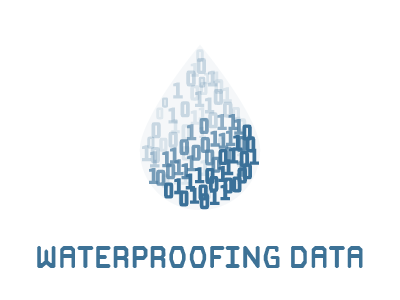

## Waterproofing Data

Waterproofing Data investigates the governance of water-related risks, with a focus on social and cultural aspects of data practices.
The project has been conducted by a highly skilled international team of researchers with multiple disciplinary backgrounds from Brazil, 
Germany and the UK, in close partnership with researchers, stakeholders and the public of a multi-site case study on 
flood risk management in Brazil. Furthermore, the methods and results of this case study will be the basis for a 
transcultural dialogue with government organisations and local administration involved in flood risk management in 
Germany and the United Kingdom. 

`For More information about the Waterproofing Data Project visit:` 

[Urban Big Data Centre, University of Glasgow](https://www.ubdc.ac.uk/research/research-projects/urban-sustainability-participation/waterproofing-data)


## About this repo

This is a repository that compiles the different components developed for the [Waterproofing Data project](https://www.ubdc.ac.uk/research/research-projects/urban-sustainability-participation/waterproofing-data/).
It includes the different elements working together to make

## Getting the project

Clone the repository locally:

```sh
git clone https://github.com/urbanbigdatacentre/waterproofingdataplatform.git
```

## Development setup

To set up the development environment you would follow the instructions given for every component folder. 
The following sections will explain each of those components and is correspondent folder structure.

`Note: Always refer to the module's README.md files for the most accurate instructions for setting up your development.`


## 1. WPD Documentation
Access ---> [WPD-Docs](WPD-Docs)

This the main documentation repository of the project. 
It contains the technical documentation from the Mobile App, Authentication Module and Query API components.
The resources were created using [read-the-docs](https://readthedocs.org/) services, [sphinx](https://www.sphinx-doc.org/en/master/index.html) compiler and [reStructuredText](https://docutils.sourceforge.io/rst.html) markup language.
To deploy this component, you need to install `sphinx` compiler and the documentation theme to your local machine, preferably using python package manager. 

## 2. WPD Mobile App

Access ---> [WPD-MoobileApp](WPD-MobileApp)

This is the module for the mobile application [Waterproofing Data](https://play.google.com/store/apps/details?id=com.dadosaprovadagua.wpdmobileapp). This application allows citizens to register self-made rainfall gauges, collect their rainfall measures and report rain and flood events.
The module contains the components developed for a mobile app using [React Native](https://reactnative.dev/) and [Expo](https://docs.expo.io/). For running unit tests, you can use [Jest](https://docs.expo.io/guides/testing-with-jest).

## 3. WPD Query API Server

Access ---> [WPD-WebServer](WPD-WebServer)

This is the module for the Query API that enables communication between the [Mobile App](https://play.google.com/store/apps/details?id=com.dadosaprovadagua.wpdmobileapp) and
the [Dashboard](https://waterproofing-data.ubdc.ac.uk) interfaces, and the backend components. This module uses a [NodeJS]() web server to expose a Query API to hadle client requests. 
This API enables access to a metadata-oriented database that summaries the multiple data sources feeding the platform. 
Details of the database model can be seen in the [Database Model](WPD-MobileApp/db/wpd.erd.pdf).

## 4. WPD Authentication Module

Access ---> [WPD-Auth](WPD-Auth)

This is the module that handles user's authentication for the Waterproofing Data (WPD) [Mobile App](https://play.google.com/store/apps/details?id=com.dadosaprovadagua.wpdmobileapp).
It includes a complete [Swagger documentation](https://urbanbigdatacentre.github.io/WPD-Auth/).
The module has dependencies from [Maven Project](https://maven.apache.org/), [Java 16](http://openjdk.java.net/projects/jdk/16/),
[Spring Boot 2.5.3](https://spring.io/projects/spring-boot/), [PostgreSQL](https://www.postgresql.org/) 
([Homebrew preferably](https://formulae.brew.sh/formula/postgresql))

## 5. WPD Data Lake

Access ---> [WPD-DataLake](WPD-DataLake)

This is the module contains the components that handle data ingestion and pre-processing for the [Waterproofing Data project](https://www.ubdc.ac.uk/research/research-projects/urban-sustainability-participation/waterproofing-data/).
The components rely on an Azure [Data Lake Storage Gen2](https://learn.microsoft.com/en-us/azure/storage/blobs/data-lake-storage-introduction) subscription and a series of [Azure Function](https://learn.microsoft.com/en-us/azure/azure-functions/functions-overview) written in Python.
To further develop this module you should follow instructions on developing [Azure Function for Python](https://learn.microsoft.com/en-us/azure/azure-functions/functions-overview) and [Azure Functions Core Tools V3](https://learn.microsoft.com/en-us/azure/azure-functions/functions-run-local?tabs=v4%2Cmacos%2Ccsharp%2Cportal%2Cbash#install-the-azure-functions-core-tools)


## 6. WPD Web interface (Depreated)

Access ---> [WPD-DataLake](WPD-WebClient)

This is the module that looked for an integrated interface for visualising the data produced by citizens and the official records. 
The module implements a geospatial data viewer based on [Angular CLI](https://github.com/angular/angular-cli) version 8.1.0.
The lessons learned during the development of this module became valuable inputs for the development of the project's Dashboard.


## Getting the project

Clone the repository locally:

the components that handle data ingestion and pre-processing for the [Waterproofing Data project](https://www.ubdc.ac.uk/research/research-projects/urban-sustainability-participation/waterproofing-data/).
The components rely on an Azure [Data Lake Storage Gen2](https://learn.microsoft.com/en-us/azure/storage/blobs/data-lake-storage-introduction) subscription and a series of [Azure Function](https://learn.microsoft.com/en-us/azure/azure-functions/functions-overview) written in Python.
To further develop this module you should follow instructions on developing [Azure Function for Python](https://learn.microsoft.com/en-us/azure/azure-functions/functions-overview) and [Azure Functions Core Tools V3](https://learn.microsoft.com/en-us/azure/azure-functions/functions-run-local?tabs=v4%2Cmacos%2Ccsharp%2Cportal%2Cbash#install-the-azure-functions-core-tools)


## Further help
For any bugs, queries or feature improvements contact <diego.pajaritograjales@glasgow.ac.uk>.